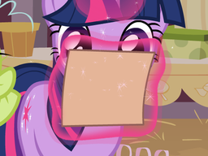
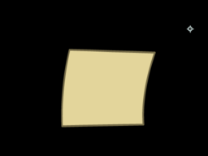
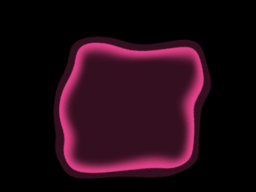

# DISCONTINUED AS OVERCOMPLICATED, SEE [MLP-4K-Tools](https://github.com/Shimmermare/MLP-4K-Tools) #  
  
## MLP AFX Plumbing Toolkit ##  
A few Flash and After Effects scripts to make live of a *plumber* easier.  
  
This toolkit, roughly speaking, replicates Flash-AFX pipeline that was used by DHX Media during production of My Little Pony: Friendship is Magic.  
  
### How to install ###  
1. Get Adobe After Effects 13.0 (2014) or later.  
2. Get Flash (*not Flash Player*). **Use Macromedia Flash 8 for seasons 1-4, Adobe Flash CS4 for seasons 5-6 and Adobe Flash CC for seasons 7-9.**  
3. Create After Effects project in a separate folder anywhere you like. Save that project at least once.  
4. Download toolkit and place it anywhere you like. To use it, you can either install it (recommended) or run scripts manually through **`File -> Scripts -> Run Script File...`**.  
4.1. (Optional) Install toolkit: **`File -> Scripts -> Run Script File...`** and select **`InstallToolkit.jsx`**. Now you can delete downloaded toolkit files.  
4.2. (Optional) Reload After Effects.  
4.3. (Optional) **`Window -> MLP-AFX-Plumbing-Toolkit.jsx`** to open toolkit window. You can add it to main UI by simple drag-and-drop.  
5. Use **`InitProject.jsx`** script to initialize project. Type in flash executable location and other parameters.  
6. **Don't delete created project items (`__PROJECT_ID__`, `Scenes`, `ScenesRemoved`, composition with the name of project).**  
  
### How to use ###  
  
#### Scenes ####  
Flash source folder is **`(project dir)/ScenesFlash/`**. When you add, modify or delete flash scenes, use **`UpdateScenes.jsx`** script. It will automatically render new scenes, re-render modified (*only modified!*) scenes, and move deleted scenes to **`ScenesRemoved`**.  
  
#### Rescale ####  
Use **`Rescale.jsx`** to rescale project.  
  
#### Fit ####
Use **`Fit.jsx`** to fit selected layer into composition.  
  
#### Magic FX ####  
Magic FX is a few simple effects on a layer.  
  
To get this result:  
  
  
You need to render affected object as PNG frame sequence or use AFX mask. **Regardless of method, only the object should be in the scene.** That looks like this:  
  
  
Use **`AddMagicFX.jsx`** to add magic FX to **currently selected layer**.  
  
##### Main Parameters #####  
* **Color**: magic color in hex.  
* **Underlay**: the farthest tint of magic. Lower values means bigger size.  
* **Overlay outer edge**: the size of brightest part of effect.  
* **Overlay inner edge**: this size of inner, smooth edge of effect.  
  
Values of **`#ED438D`**, **`-20.5`**, **`-20.9`**, **`-7.8`** give this effect:  
  
  
To easily modify effect, select layer and use **`EditMagicFX.jsx`**.  